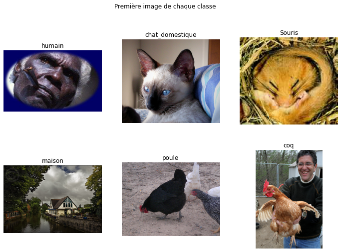
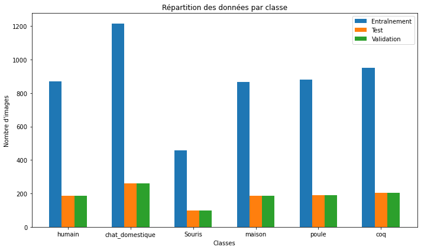

# Reseaux_neurones_Convolutionnels_CNN

Ce projet se concentre sur la création d'un ensemble de données d'images en utilisant des données de l'ensemble de données ImageNet pour l'entraînement et l'évaluation de réseaux de neurones convolutionnels (CNN). Il vise à fournir un jeu de données complet et étiqueté pour la reconnaissance d'objets, en se concentrant sur des classes spécifiques telles que l'humain, le chat domestique, la souris, la maison, la poule et le coq.

Téléchargement des Images ImageNet

Vous pouvez télécharger les images pour chaque classe à partir de l'ensemble de données ImageNet en utilisant les liens suivants :

- [Humain (wnid: n00007846)](https://image-net.org/data/winter21_whole/n00007846.tar) - Téléchargement via [lien](https://image-net.org/data/winter21_whole/n00007846.tar)
- [Chat Domestique (wnid: n02123597)](https://image-net.org/data/winter21_whole/n02123597.tar) - Téléchargement via [lien](https://image-net.org/data/winter21_whole/n02123597.tar)
- [Souris (wnid: n02352591)](https://image-net.org/data/winter21_whole/n02352591.tar) - Téléchargement via [lien](https://image-net.org/data/winter21_whole/n02352591.tar)
- [Maison (wnid: n03544360)](https://image-net.org/data/winter21_whole/n03544360.tar) - Téléchargement via [lien](https://image-net.org/data/winter21_whole/n03544360.tar)
- [Poule (wnid: n01514859)](https://image-net.org/data/winter21_whole/n01514859.tar) - Téléchargement via [lien](https://image-net.org/data/winter21_whole/n01514859.tar)
- [Coq (wnid: n01514668)](https://image-net.org/data/winter21_whole/n01514668.tar) - Téléchargement via [lien](https://image-net.org/data/winter21_whole/n01514668.tar)

Objectifs

Les principaux objectifs de ce projet sont les suivants :

Télécharger et organiser les images à partir d'ImageNet pour chaque classe spécifique.
Prétraiter les données en éliminant les images de mauvaise qualité et en les divisant en ensembles d'entraînement, de test et de validation.
Fournir une structure de répertoire claire pour faciliter l'utilisation des données.
Créer un ensemble de données étiqueté pour la reconnaissance d'objets, prêt à être utilisé pour l'entraînement de modèles de réseaux de neurones convolutionnels (CNN).

Prérequis
Python 3
Bibliothèques Python : os, cv2, matplotlib, numpy, PIL

Utilisation

Téléchargez les images pour chaque classe en utilisant les liens fournis ci-dessus.
Assurez-vous que les bibliothèques Python requises sont installées.
Utilisez les scripts chargementimagenet.py et presentationDonne.py pour prétraiter et explorer les données.
Vous pouvez également utiliser ces données pour l'entraînement de modèles CNN pour la reconnaissance d'objets.

Preentation des donnees des classes

Diagramme representant la repartition des images dans chaque class

